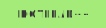

  <h1>Hello 👋</h2>

<table align="center">
  <tr>
    <td width="33%">
      <h1 align="center">
        
        Languages
      </h1>
    </td>
    <td width="33%">
      <h1 align="center">
        
        Frameworks
      </h1>
    </td>
    <td width="33%">
      <h1 align="center">
        
        Databases
      </h1>
    </td>
  </tr>
  <tr>
    <td align="center">
      
      
      
      
      
    </td>
    <td align="center">
      
      
      
    </td>
    <td align="center">
    </td>
  </tr>
</table>

<table align="center">
  <tr>
    <td width="33%">
      <h1 align="center">
        
        Productivity
      </h1>
    </td>
    <td width="33%">
      <h1 align="center">
        
        OS
      </h1>
    </td>
    <td width="33%">
      <h1 align="center">
        
        Tools
      </h1>
    </td>
  </tr>
  <tr>
    <td align="center">
      
      
      
    </td>
    <td align="center">
      
      
      
      
    </td>
    <td align="center">
      
      
      
      
      
      
      
      
      
    </td>
  </tr>
</table>

  <h1>
    
    Stats
  </h1>

|  |  |
| :---------------------------------------------------------------------------------------------------------------------------------------------------------------------------------------------------------------------------: | :----------------------------------------------------------------------------------------------------------------------------------------------------------------------: |
